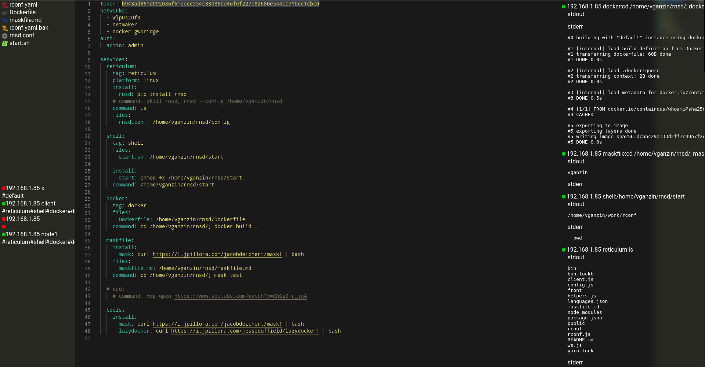

# rconf

rconf is configuration server with web UI that will sync service configuration to remote machines instantly.


- partial syncronization for different node roles
- cross-platform configuration
- single binary, no deps
- one line installation `curl https://i.jpillora.com/slavaGanzin/rconf! | bash`

### quick start
**install rconf on server machine**
```bash
curl https://i.jpillora.com/slavaGanzin/rconf! | bash
```

**run rconf and configure your server by answering a list of questions**
```bash
$ rconf                                                                                                                               

? Select networks will share your config:
 wlp0s20f3 [192.168.1.85/24]
? Web GUI username: admin
? Web GUI password: admin
? Remote sync token: ea9b50e5de7e17e0ff38f0b7808917acbbe87ca6ce46ee831d5c009bf87a2049
? Daemonize with systemd? No
To install on remote machine:
  curl https://i.jpillora.com/slavaGanzin/rconf! | bash

wlp0s20f3:
  Web UI:
    http://192.168.1.85:14141  
  sync config command:
    rconf http://192.168.1.85:14141/ea9b50e5de7e17e0ff38f0b7808917acbbe87ca6ce46ee831d5c009bf87a2049
```

**open web UI**
```bash
# this is my internal ip, look for your url in your own cli
chromium http://192.168.1.85:14141
```

**edit config in web UI**
```yaml
services: {}
# change to
services:
  hello:
    command: echo "Hello world!"
```
*Press CTLR+S to save!*

**copy sync config command from server console and run it**
```bash
$ rconf "http://192.168.1.85:14141/ea9b50e5de7e17e0ff38f0b7808917acbbe87ca6ce46ee831d5c009bf87a2049"

? Node id: node1
? Select tags to sync:
 default
? Daemonize with systemd? No
✔ run: echo "Hello world!"
Hello world!
```
